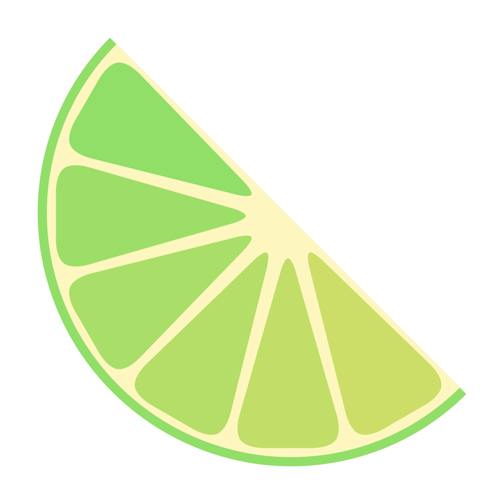

  

# LIME: Fantasy Machine Emulator
_Bring your fantasy machine to life._ 🧠✨

> ⚠️ **Work in Progress** — LIME is still under active development.

**LIME** (short for _**L**ightweight **I**maginary **M**achine **E**mulator_) is a lightweight emulator for architectures that exist — or *could exist* — only in your mind. Whether you're building your own fictional ISA or exploring the internals of creative community-driven platforms, LIME aims to be your go-to sandbox.

One of the goals of LIME is to support a wide range of CPUs, computers and fantasy consoles like the ones in this list:
- [fox32](https://github.com/fox32-arch)
- [XrArch](https://github.com/xrarch)
- [OkamiStation](https://github.com/TalonFloof/OkamiStation)
- [Aphelion](https://github.com/orbit-systems/aphelion)
- [doubleword](https://github.com/WilliamBattsIII/doubleword)
- [Vicera](https://codeberg.org/vicera)
- [YETI-16](https://github.com/MESYETI/YETI-16)
- [Talea](https://github.com/uri-nyx/Talea)
- [X16](https://github.com/emd22/x16)
- [Aboloka-8](https://github.com/Avuxo/Aboloka-8)
- [C32](https://github.com/Toriiiiiiiiii/C32)
- [ACE-8](https://github.com/Toriiiiiiiiii/ACE-8)
- [OSP-8](https://github.com/Toriiiiiiiiii/OSP-8)
- [OSP2](https://github.com/Toriiiiiiiiii/OSP2)  
...and many more to come.

## ✨ Why LIME?

Whether you're designing a retro-futuristic console, a forgotten alien CPU, or a DIY 8-bit microcontroller, LIME gives you the playground to make it real.

Designing a new architecture is already a challenge — building a custom emulator for it shouldn't be.

LIME was born from the desire to provide a **minimal yet extensible** platform for prototyping and running fantasy ISAs. It abstracts away the boilerplate of writing an emulator from scratch, so you can focus on what matters: your architecture, your ideas, your world.

Key goals include:
- 🧠 **Architecture-first development**: Simulate without reinventing the wheel.
- 🔌 **Composable and modular**: Create reusable devices and communication protocols.
- 🤝 **Cross-architecture interaction**: Imagine a world where different ISAs can talk to each other.

> LIME is built on the idea that creativity shouldn't be bottlenecked by infrastructure. If you can dream a machine, you can run it.

## 📦 What's next?

Expect frequent updates as LIME grows.

Next milestones:
- 🛠️ Advanced loggers for easier multi-threaded development
- 🔥 Stealing thread pool for blazing-fast simulations
- 📚 Core container types (list, array, queue, etc.)
- ⏱️ Time- and event-driven simulation engines
- ✅ Tests, docs, and real-world examples

## 🤝 Contributions

Contributions, suggestions, and discussions are always welcome — whether you're building an imaginary computer or just curious about how they work.

Feel free to open Issues or Pull Requests!

## ⚖️ License

The project is in its infancy but it already embraces the philosophy of the [CC0 1.0 Universal license](./LICENSE). This allows you to easily integrate the emulator into your projects without having to think about the inclusion of extra licenses.

---

_Ready to bring your imaginary machine to life?_